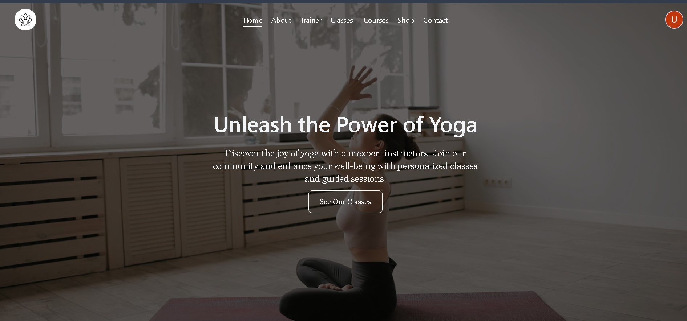
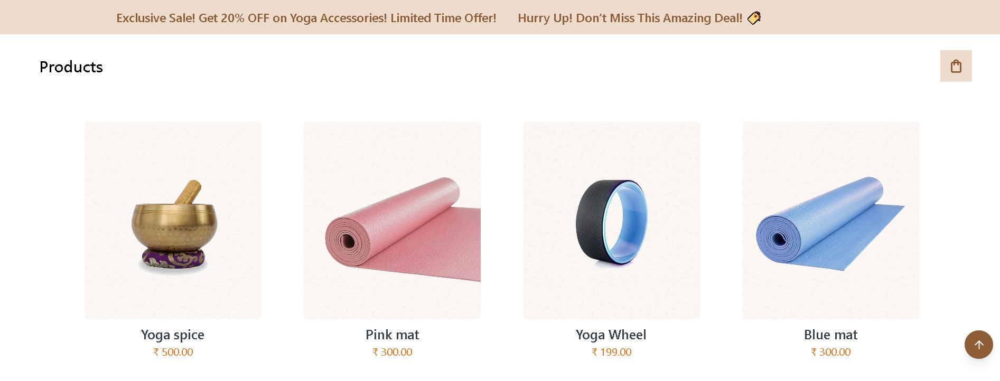
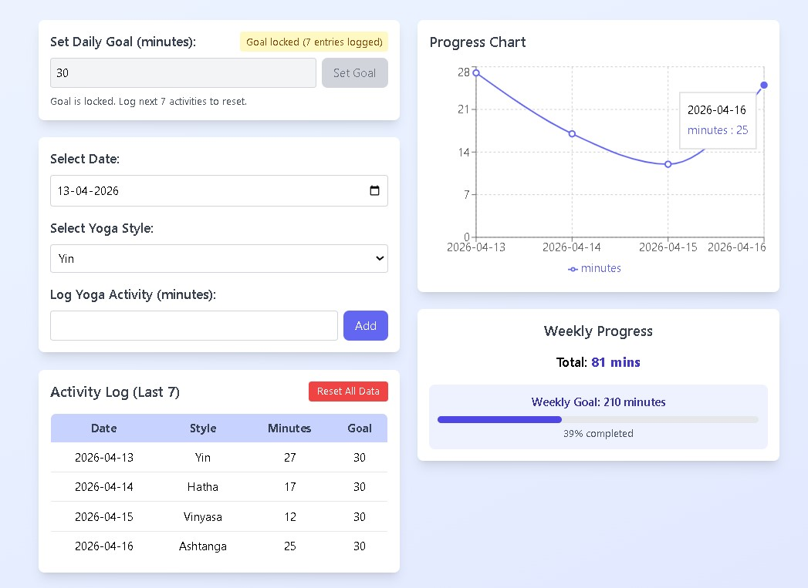
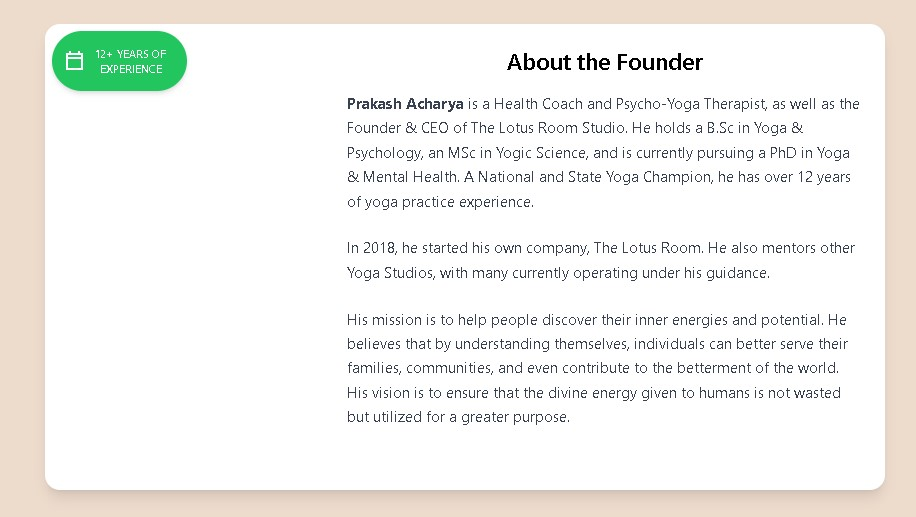
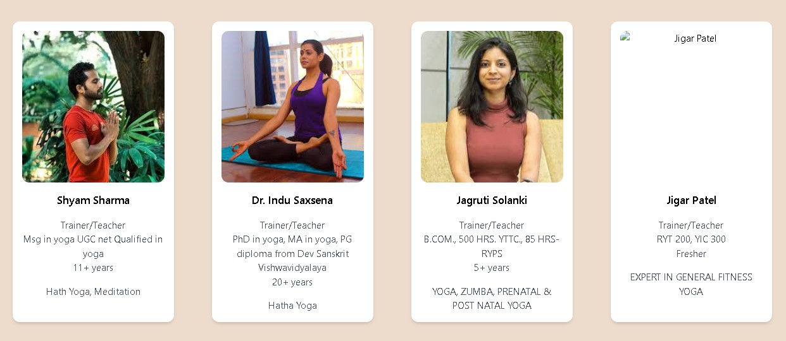

# 🧘 Lotus Room - QA Testing Project

## 📌 Project Overview

This project demonstrates end-to-end manual testing of a multi-module yoga web application. The application includes features like course registration, shopping cart, order management, yoga library, and progress tracking.

🌐 **Live Website:** https://thelotusroom.netlify.app

---

## 📂 Project Structure

```

LotusRoom-Testing
│
├── QA_Documents/
│ └── The_lotus_room_Testing.xlsx
│
├── Images/
│ ├── Founder_image_bug.jpg
│ ├── Home_page.jpg
│ ├── progress-tracker.png
│ ├── Shop_page.jpg
│ ├── Trainer_image_bug.jpg
│
├── LICENSE
│
└── README.md

```
---

## 🧪 Testing Scope

Performed comprehensive manual testing including:

* Functional Testing
* UI Testing
* Validation Testing
* Navigation Testing
* Integration Testing
* Negative Testing
* Responsive Testing

---

## 📂 Modules Tested

* Home Page
* Login / Logout
* Courses
* Shop & Product Detail
* Cart & Checkout
* Orders
* Yoga Library
* Online Classes
* Progress Tracker
* Contact Page
* Privacy Policy & Terms

---

## 📊 Test Deliverables

* ✔ Test Scenarios
* ✔ Test Cases
* ✔ Bug Reports
* ✔ Requirement Traceability Matrix (RTM)

---

## 🐞 Key Defects Identified

* Form submission without validation
* Image loading issues (Trainer, Products, Founder)
* Duplicate data entries
* Broken links

---

## 📸 Screenshots

### 🏠 Website UI





---

### 🐞 Bug Evidence




---

## 🛠 Tools Used

* Microsoft Excel
* Manual Testing Techniques

---

## 🎯 Conclusion

This project demonstrates practical knowledge of manual testing processes including test case design, defect reporting, and traceability management.

---

## 👤 Author

**Uday Sathwara**
